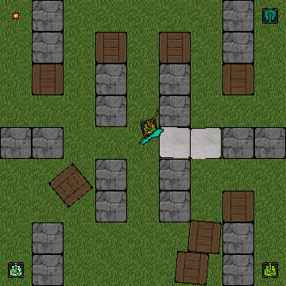

# Capture the Flag Arena

This repository contains a Python based project built around interactive state management, agent coordination, visual feedback, and organized data handling. The architecture supports multiple components working in tandem, demonstrated in this repository through a Capture the Flag inspired simulation.

  

## Skills Demonstrated

* Modular Python architecture and clear separation of concerns
* Event driven logic and state management
* Agent behavior, movement, and interaction handling
* Spatial reasoning, line of sight checks, and collision handling
* Asset management for textures, fonts, sprites, and sound
* Menu flow, basic UI elements, and in game feedback
* Readable, maintainable code structure suited for extension

## Project Overview

### ctf.py

Main loop, update cycle, and orchestration of entities, interactions, and win or loss conditions.

### ai.py

Agent behavior logic, including movement choices, targeting, and simple tactical decision making.

### gameobjects.py

Definitions and behavior for tanks, bullets, flags, obstacles, and other core entities.

### maps.py

Loading and parsing of map layouts, coordinate grids, and static environmental features.

### alternative boundaries.py

Experimental logic for alternative boundary handling and collision strategies.

### menu_screen.py

Simple and extensible menu system for navigation, game start, and configuration.

### images.py

Centralized loading for textures, fonts, sprites, and image based resources.

### progress_report.md

Development log and notes used during the creation and iteration of the project.

### data/ and Music/

All sprites, textures, fonts, music, and sound effects used by the project.